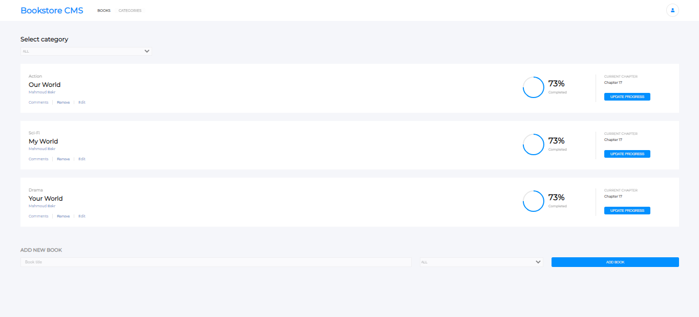

# Limerary

> This is a book-store application where the user can do multiple interactions using the features provided to them which is built and delivered using react and redux.

## Built With

- Javascript
- React
- Redux
- babel, css, eslint, stylelint, jest

## Live Demo

[See project](https://limerary.herokuapp.com/)

## Getting Started

To get a local copy up and running follow these simple example steps.

- Open your terminal
Then run the following command line
- `git clone https://github.com/MahmoudBakr23/Limerary.git`
Then run the following command line
- `cd Limerary`
Then install the required npm packages to run the app
- `npm i`
Then run this command line to start the app
- `npm run start`

### Run tests
To run the tests type this command line in the terminal
- `npm run test`

## Authors

👤 **Mahmoud Bakr**

- GitHub: [@githubhandle](https://github.com/MahmoudBakr23)
- LinkedIn: [LinkedIn](https://www.linkedin.com/in/m-bakr/)

## 🤝 Contributing

Contributions, issues, and feature requests are welcome!

Feel free to check the [issues page](https://github.com/MahmoudBakr23/Limerary/issues).

## Show your support

Give a ⭐️ if you like this project!

## Acknowledgments

- [Microverse](https://www.microverse.org/)

## 📝 License

License free.